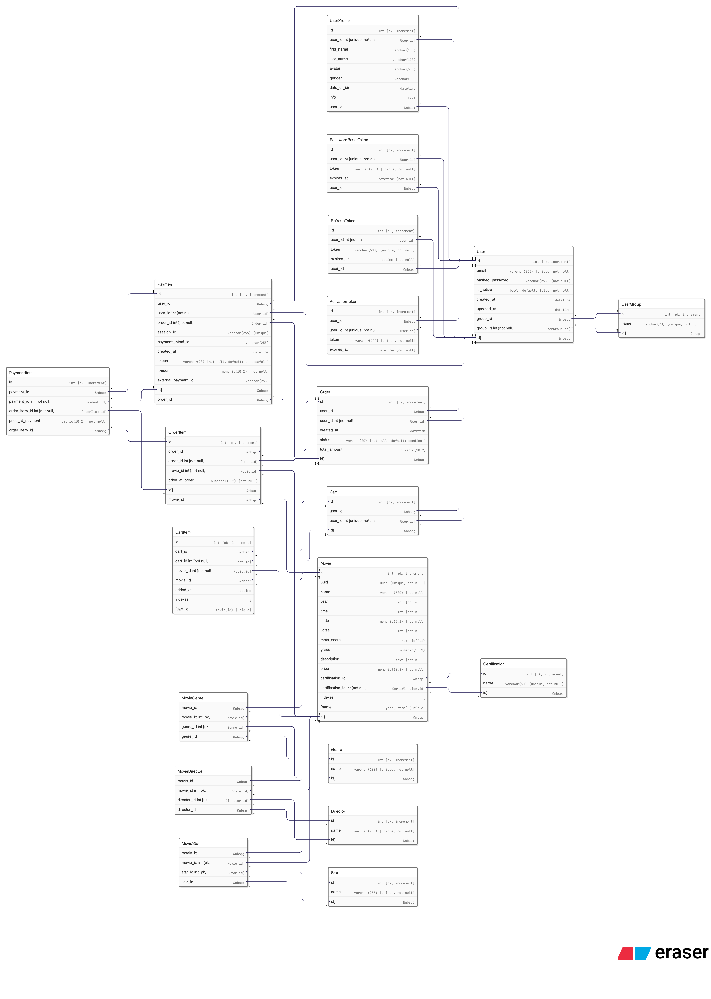

# Cinema API

RESTful API for an online cinema platform with movie sales system, shopping cart, and Stripe payment integration.

## Table of Contents

- [Technologies](#technologies)
- [Database Schema](#database-schema)
- [Key Features](#key-features)
- [Installation](#installation)
- [Running the Application](#running-the-application)
- [API Endpoints](#api-endpoints)
- [Testing](#testing)
- [Useful Commands](#useful-commands)
- [Service Access](#service-access)
- [Notes](#notes)

## Technologies

### Backend
- **FastAPI** - Modern asynchronous web framework
- **SQLAlchemy 2.0** - ORM for database operations
- **Alembic** - Database migration system
- **Pydantic** - Data validation and schemas
- **Passlib + Bcrypt** - Password hashing
- **Python-Jose** - JWT tokens for authentication

### Database and Caching
- **PostgreSQL** - Primary database
- **Redis** - Message broker for Celery

### Asynchronous Tasks
- **Celery** - Distributed task queue system
- **Email notifications** - Email sending via MailHog/SMTP

### Payments and Storage
- **Stripe** - Payment processing system
- **MinIO** - S3-compatible object storage for avatars

### DevOps
- **Docker & Docker Compose** - Containerization
- **Poetry** - Dependency management
- **Pytest** - Testing framework
- **pgAdmin** - Web interface for PostgreSQL

## Database Schema



### Users and Authentication

The system implements a role-based access control (RBAC) model with three user groups:
- USER - Regular users who can browse and purchase movies
- MODERATOR - Users who can manage movie content
- ADMIN - Full system access

**User Management Tables:**
- `user_groups` - User roles (USER, MODERATOR, ADMIN)
- `users` - Core user data (email, password, active status)
- `user_profiles` - Extended user information (first_name, last_name, avatar, gender, date_of_birth, info)

**Authentication Tables:**
- `activation_tokens` - Account activation tokens (expires after 30 minutes)
- `password_reset_tokens` - Password reset tokens (expires after 15 minutes)
- `refresh_tokens` - JWT refresh tokens (expires after 7 days)

### Movies and Metadata

The movie system uses a flexible many-to-many relationship model for categorization:

**Core Movie Table:**
- `movies` - Main movie information
  - Basic info: name, year, duration (time)
  - Ratings: imdb (0-10), votes, meta_score (0-100)
  - Financial: gross, price
  - Content: description
  - Classification: certification_id (foreign key)
  - Unique identifier: uuid

**Related Tables (Many-to-Many):**
- `genres` - Movie genres (Action, Drama, Comedy, etc.)
- `directors` - Movie directors
- `stars` - Movie actors/stars
- `certifications` - Age ratings (G, PG, PG-13, R, etc.) - One-to-Many relationship

**Association Tables:**
- `movie_genres` - Links movies to genres
- `movie_directors` - Links movies to directors
- `movie_stars` - Links movies to stars

### Shopping Cart and Orders

**Cart System:**
- `carts` - User shopping carts (one per user)
- `cart_items` - Movies in cart with timestamp
  - Unique constraint: one movie per cart
  - Automatic validation against purchased movies

**Order System:**
- `orders` - User orders with status tracking
  - Status: PENDING, PAID, CANCELED
  - Fields: user_id, created_at, total_amount
- `order_items` - Individual movie purchases
  - Stores price_at_order for historical accuracy

**Payment System:**
- `payments` - Stripe payment records
  - Status: SUCCESSFUL, CANCELED, REFUNDED
  - External references: session_id, payment_intent_id, external_payment_id
  - Links to user and order
- `payment_items` - Individual payment line items
  - Links to order_items
  - Stores price_at_payment

### Database Relationships

**One-to-One:**
- User -> UserProfile
- User -> Cart
- User -> ActivationToken
- User -> PasswordResetToken

**One-to-Many:**
- UserGroup -> Users
- User -> Orders
- User -> Payments
- User -> RefreshTokens
- Order -> OrderItems
- Payment -> PaymentItems
- Movie -> OrderItems
- Certification -> Movies

**Many-to-Many:**
- Movies <-> Genres (via movie_genres)
- Movies <-> Directors (via movie_directors)
- Movies <-> Stars (via movie_stars)

### Database Constraints

**Unique Constraints:**
- User email (indexed)
- Movie identity (name + year + time)
- Cart item (cart_id + movie_id)
- User profile (user_id)
- Activation token (user_id, token indexed)
- Password reset token (user_id, token indexed)
- Refresh token (token indexed)
- Stripe session_id (indexed)

**Indexes:**
- users.email
- movies.name
- movies.year
- payments.external_payment_id
- payments.session_id
- payments.payment_intent_id

## Key Features

### Authentication and Authorization
- User registration with email verification
- JWT tokens (access + refresh)
- Password reset via email
- Role-based access control (User, Moderator, Admin)
- Secure password hashing with Bcrypt (14 rounds)
- Token expiration management
- Automatic cleanup of expired tokens (hourly via Celery Beat)

### Movie Management
- CRUD operations for movies (Moderator+)
- Search by title and description
- Advanced filtering by year, rating, price, genres, certifications
- Sorting by multiple fields
- Pagination support
- Categories: genres, directors, stars, certifications
- Trending movies (by votes and IMDB rating)
- New releases (by year)
- Movies by genre
- UUID-based movie identification

### Shopping Cart and Orders
- Add movies to cart
- Remove items from cart
- Clear entire cart
- View cart total and item count
- Create order from cart
- Prevent duplicate purchases
- Validate item availability
- Automatic cart cleanup after order creation
- Order status tracking

### Payments
- Stripe Checkout integration
- Webhook handling for payment events
- Email order confirmations
- Automatic order status updates
- Payment history tracking
- Session expiration (1 hour)
- Secure webhook signature verification

### User Profiles
- Personal information management
- Avatar upload to MinIO
- Presigned URLs for images (1 hour expiration)
- Gender and date of birth
- Additional info field
- Automatic old avatar cleanup

### Email Notifications
- Account activation
- Password reset
- Order confirmations
- Password change notifications
- Asynchronous sending via Celery
- Retry mechanism with exponential backoff
- HTML email templates

## Installation

### Requirements
- Python 3.11+
- Docker and Docker Compose
- Poetry

### Step 1: Clone the repository
```bash
git clone https://github.com/turulko-oleksandr/cinema-api.git
cd cinema-api
```

### Step 2: Configure environment variables
```bash
cp .env.example .env
```

Edit `.env` and set:
- `SECRET_KEY_ACCESS` and `SECRET_KEY_REFRESH` (minimum 32 characters)
- `POSTGRES_PASSWORD`
- `PGADMIN_DEFAULT_PASSWORD`
- `MAILHOG_PASSWORD`
- `MINIO_ROOT_PASSWORD`
- `STRIPE_SECRET_KEY`, `STRIPE_PUBLISHABLE_KEY`, `STRIPE_WEBHOOK_SECRET`

### Step 3: Install dependencies
```bash
poetry install
```

## Running the Application

### Running with Docker Compose
```bash
docker-compose up -d
```

This will start:
- PostgreSQL (port 5433)
- pgAdmin (port 5050)
- Redis (port 6379)
- MinIO (port 9000, console 9001)
- MailHog (SMTP 1025, UI 8025)
- FastAPI (port 8010)
- Celery Worker
- Celery Beat

### Local Development (without Docker)

1. **Start infrastructure services:**
```bash
docker-compose up -d postgres redis minio mailhog
```

2. **Apply database migrations:**
```bash
poetry run alembic upgrade head
```

3. **Seed database with test data:**
```bash
poetry run python app/scripts/seed_database.py
```

4. **Start FastAPI application:**
```bash
poetry run uvicorn app.main:app --reload --port 8010
```

5. **Start Celery Worker:**
```bash
poetry run celery -A app.celery_app worker --loglevel=info
```

6. **Start Celery Beat:**
```bash
poetry run celery -A app.celery_app beat --loglevel=info
```

## API Endpoints

### Documentation
- **Swagger UI**: http://localhost:8010/docs
- **ReDoc**: http://localhost:8010/redoc

### Main Endpoints

#### Authentication (`/api/v1/accounts`)
- `POST /register/` - User registration
- `POST /activate/` - Account activation
- `POST /login/` - User login
- `POST /refresh/` - Refresh access token
- `POST /password-reset/request/` - Request password reset
- `POST /reset-password/complete/` - Complete password reset

#### Movies (`/api/v1/movies`)
- `GET /` - List movies with pagination
- `GET /{id}` - Get movie details
- `GET /uuid/{uuid}` - Get movie by UUID
- `GET /search/query` - Search movies
- `GET /filter/advanced` - Filter movies
- `GET /special/trending` - Get trending movies
- `GET /special/new-releases` - Get new releases
- `GET /genre/{genre_id}` - Get movies by genre
- `POST /` - Create movie (Moderator+)
- `PATCH /{id}` - Update movie (Moderator+)
- `DELETE /{id}` - Delete movie (Moderator+)

#### Shopping Cart (`/api/v1/cart`)
- `GET /` - Get user cart
- `POST /items` - Add item to cart
- `DELETE /items/{movie_id}` - Remove item from cart
- `DELETE /` - Clear cart
- `GET /total` - Get cart total

#### Orders (`/api/v1/orders`)
- `POST /` - Create order from cart
- `GET /` - List user orders
- `GET /all` - List all orders (Admin)
- `GET /{id}` - Get order details
- `POST /{id}/checkout` - Create Stripe checkout session
- `GET /{id}/payment-status` - Check payment status
- `PATCH /{id}/status` - Update order status

#### Profile (`/api/v1/profile`)
- `GET /` - Get user profile
- `PUT /` - Update user profile
- `POST /avatar` - Upload avatar
- `DELETE /avatar` - Delete avatar

#### Genres (`/api/v1/genres`)
- `GET /` - List all genres
- `GET /statistics` - Genres with movie count
- `GET /{id}` - Get genre details
- `POST /` - Create genre (Moderator+)
- `PATCH /{id}` - Update genre (Moderator+)
- `DELETE /{id}` - Delete genre (Moderator+)

#### Directors (`/api/v1/directors`)
- `GET /` - List all directors
- `GET /{id}` - Get director details
- `POST /` - Create director (Moderator+)
- `PATCH /{id}` - Update director (Moderator+)
- `DELETE /{id}` - Delete director (Moderator+)

#### Stars (`/api/v1/stars`)
- `GET /` - List all stars
- `GET /{id}` - Get star details
- `POST /` - Create star (Moderator+)
- `PATCH /{id}` - Update star (Moderator+)
- `DELETE /{id}` - Delete star (Moderator+)

#### Certifications (`/api/v1/certifications`)
- `GET /` - List all certifications
- `GET /{id}` - Get certification details
- `POST /` - Create certification (Moderator+)
- `PATCH /{id}` - Update certification (Moderator+)
- `DELETE /{id}` - Delete certification (Moderator+)

#### Webhooks (`/api/v1/webhooks`)
- `POST /stripe` - Stripe webhook handler

## Testing

### Run all tests
```bash
poetry run pytest
```

### Run with coverage
```bash
poetry run pytest --cov=app --cov-report=html
```

### Run specific test file
```bash
poetry run pytest app/tests/test_movies.py
```

### Test Structure
- `test_accounts.py` - Authentication and authorization tests
- `test_movies.py` - Movie CRUD operations tests
- `test_cart.py` - Shopping cart tests
- `test_orders.py` - Order management tests
- `test_profile.py` - User profile tests
- `test_genres.py` - Genre management tests
- `test_db_integrity.py` - Database integrity tests

## Useful Commands

### Alembic Migrations
```bash
# Create new migration
poetry run alembic revision --autogenerate -m "description"

# Apply migrations
poetry run alembic upgrade head

# Rollback one migration
poetry run alembic downgrade -1

# Show current revision
poetry run alembic current

# Show migration history
poetry run alembic history
```

### Docker Commands
```bash
# View logs
docker-compose logs -f api

# Restart service
docker-compose restart api

# Stop all services
docker-compose down

# Remove volumes
docker-compose down -v

# Rebuild and restart
docker-compose up -d --build
```

### Celery Commands
```bash
# Start worker
poetry run celery -A app.celery_app worker --loglevel=info

# Start beat scheduler
poetry run celery -A app.celery_app beat --loglevel=info

# View active tasks
poetry run celery -A app.celery_app inspect active

# Purge all tasks
poetry run celery -A app.celery_app purge
```

## Service Access

- **API**: http://localhost:8010
- **API Documentation (Swagger)**: http://localhost:8010/docs
- **API Documentation (ReDoc)**: http://localhost:8010/redoc
- **pgAdmin**: http://localhost:5050
- **MinIO Console**: http://localhost:9001
- **MailHog UI**: http://localhost:8025

## Notes

### Stripe Webhook Testing
To test webhooks locally, use Stripe CLI:
```bash
stripe listen --forward-to localhost:8010/api/v1/webhooks/stripe
```

### Email Testing
MailHog intercepts all outgoing emails. View them at http://localhost:8025

### Test Data
After running `seed_database.py`, the following test accounts will be created:
- Admin: `admin@example.com` / `Admin123!`
- Moderator: `moderator@example.com` / `Moderator123!`
- User: `user@example.com` / `User123!`

### Password Requirements
- Minimum 8 characters
- Maximum 128 characters
- At least one uppercase letter
- At least one lowercase letter
- At least one digit
- At least one special character (@$!%*?#&)

### Celery Scheduled Tasks
- Token cleanup: Runs every hour to remove expired activation and password reset tokens

### File Upload Limits
- Avatar maximum size: 5MB
- Allowed image types: JPEG, JPG, PNG, WebP

## Project Structure
```
cinema-api/
├── alembic/                    # Database migrations
│   └── versions/              # Migration files
├── app/
│   ├── config/                # Configuration files
│   ├── crud/                  # Database operations
│   ├── database/              # Database models and session
│   ├── exceptions/            # Custom exceptions
│   ├── notifications/         # Email service
│   ├── routes/                # API endpoints
│   ├── schemas/               # Pydantic schemas
│   ├── scripts/               # Utility scripts
│   ├── services/              # Business logic
│   ├── tasks/                 # Celery tasks
│   ├── tests/                 # Test files
│   ├── celery_app.py         # Celery configuration
│   └── main.py               # FastAPI application
├── docker-compose.yml         # Docker services configuration
├── Dockerfile                 # API container definition
├── pyproject.toml            # Python dependencies
├── poetry.lock               # Locked dependencies
├── alembic.ini               # Alembic configuration
├── pytest.ini                # Pytest configuration
├── .env.example              # Environment variables template
├── .dockerignore             # Docker ignore rules
└── .gitignore                # Git ignore rules
```

## License

MIT

## Author

[Turulko Oleksandr](https://github.com/turulko-oleksandr)

---

**Status**: Production Ready